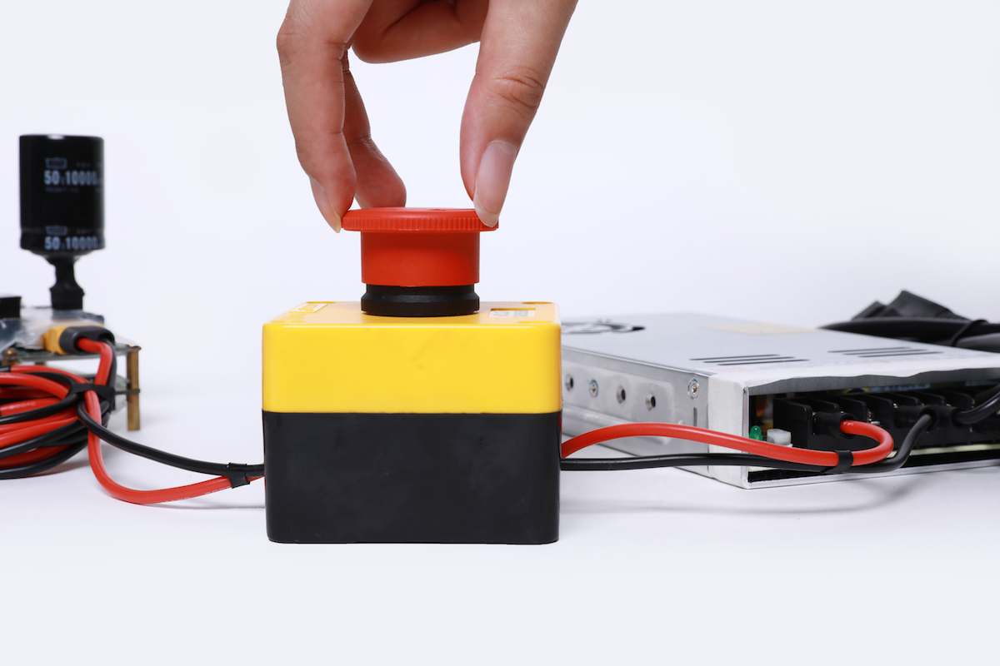
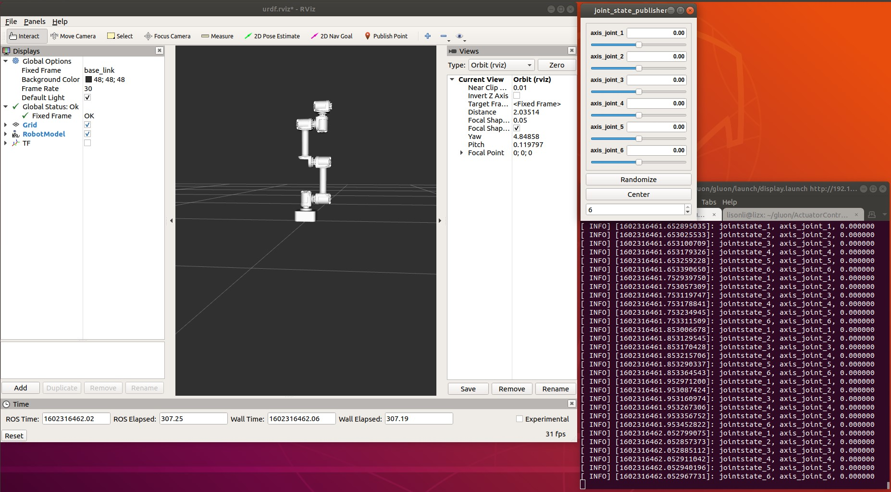

# dexter_ros
dexter robotics arm ros package
[TOC]
# 目录

---------
## 硬件需求与连接
### 连接电源
连接电源与ECB  
  
### 连接执行器及其配件
连接执行器综合线缆  
  
### 连接机械臂
用执行器连接线连接ECB与执行器  

### 连接电脑
用网线连接ECB与电脑  

### 连接后整体视图

### 开启电源
  
上电以后，执行器LED状态灯会变成黄色闪烁，启动执行器后，LED会变成绿色闪烁，这时就可以与执行器进行通信了。如果执行器内部出现错误，LED灯会变为红色闪烁，请检查执行器错误代码。
## 硬件环境要求
OS：`Ubuntu 18.04`  
CPU: `双核 2 GHz 或更高`  
运行内存：  `2G+`  
硬盘: `最低25G`  
## ROS下载并安装
推荐使用鱼香ROS一键安装  
url: `https://fishros.org.cn/forum/topic/20/%E5%B0%8F%E9%B1%BC%E7%9A%84%E4%B8%80%E9%94%AE%E5%AE%89%E8%A3%85%E7%B3%BB%E5%88%97`  
一键安装指令  
`wget http://fishros.com/install -O fishros && . fishros`  
安装选择ROS1 Melodic桌面完整版  
## 环境变量
将环境变量添加进bash中  
`echo "source /opt/ros/melodic/setup.bash" >> ~/.bashrc`  
`source ~/.bashrc`  
如果安装了多个 ROS 发行版，~/.bashrc必须只为你当前使用的版本提供setup.bash。  
如果您只想更改当前 shell 的环境，则可以输入：  
`source /opt/ros/melodic/setup.bash`  
## 构建包的依赖项
到目前为止，已经安装了运行核心 ROS 包所需的东西。要创建和管理你自己的 ROS 工作区，有各种单独分发的工具和要求。例如，rosinstall是一种常用的命令行工具，它使您可以通过一个命令轻松下载 ROS 包的许多源代码树。  
要安装此工具和其他用于构建 ROS 包的依赖项，运行：  
`sudo apt install python-rosdep python-rosinstall python-rosinstall-generator python-wstool build-essential`  
初始化rosdep:  
`sudo rosdep init`  
`rosdep update`  
## 下载gluon软件包
开启终端，按顺序输入命令:  
`sudo apt-get update`  
`mkdir -p catkin_ws/src`  
`cd catkin_ws/src`  
### 下载机械臂ROS软件
`git clone https://github.com/mintasca/ros_gluon.git` 如果没安装git：`sudo apt-get install git`  
`cd ..`  
`git clone https://github.com/innfos/innfos-cpp-sdk.git`  
`cp –r innfos-cpp-sdk/sdk src/ros_gluon/gluon/ActuatorController_SDK`  
`cp –r innfos-cpp-sdk/sdk src/ros_gluon/gluon_control/ActuatorController_SDK`  
### 安装依赖包并编译
`sudo apt-get install ros-melodic-ros-control-boilerplate`  
`sudo apt-get install ros-melodic-moveit-visual-tools`  
`sudo apt-get install ros-melodic-moveit`  
`sudo apt-get install ros-melodic-joint-state-publisher-gui`  
`sudo apt-get install ros-melodic-ros-controllers`  
`cd catkin_ws`  
`catkin_make`  
### 配置运行环境
`echo "source /opt/ros/melodic/setup.bash" >> ~/.bashrc`  
`echo "source ~/catkin_ws/devel/setup.bash" >> ~/.bashrc`  
`source ~/.bashrc`  
这个操作只需一次操作，重新开启Terminal 终端窗口时自动设置。  
## 仿真与控制
ECB 默认IP 地址是192.168.1.30, PC 的IP 地址需要配置为同网段的192.168.1.1xx；运行demo前，需要确保机械臂在正确的零位位置。  
## Rviz 控制模式
`roslaunch gluon display.launch`  
  
正确运行后，在rviz界面中可以看到gluon 机械臂urdf模型，拖拉joint_state_publisher窗口的滑动条即可控制机械臂运动，界面中的模型和真实机械臂联动 。  
## Moveit + Rviz控制模式
`roslaunch gluon_moveit_config cm_demo.launch`  
这个demo 在rviz展示gluon 模型，在界面中拖拽至目标点或设置Goal State（预设值），点击按钮Plan -> Execute或 Plan and Execute, 我们可以看到gluon 模型运动到目标位置的运动轨迹（真机同步联动）。  
## Moveit教程实例
`roslaunch moveit_tutorials move_group_interface_tutorial.launch`  
需要在cm_demo的基础上运行，提供了joint_state space 和 Cartesian 笛卡尔空间路径规划例子。  
## 常见问题
### curl not found
`sudo apt install curl`  
### catkin_make not found
首先检查是否正确安装ros melodic，其次检查是否正确配置source 环境变量至.bashrc 或执行了相关source操作，如果前两步已经操作请尝试重启Terminal 终端窗口。  
## 编译时常见错误
### Could NOT find ros-control-boilerplate
`sudo apt-get install ros-melodic-ros-control-boilerplate`   
### Could NOT find moveit_core
`sudo apt-get install ros-melodic-moveit-core`  
### Could NOT find moveit_visual_tools
`sudo apt-get install ros-melodic-moveit-visual-tools`  
### Could NOT find moveit_ros_planning_interface  
`sudo apt-get install ros-melodic-moveit-ros-planning-interface`  
### Could NOT find moveit_ros_perception
`sudo apt-get install ros-melodic-moveit-ros-perception`  
### fatal error: actuatorcontroller.h
`cd catkin_ws`  
`cp –r innfos-cpp-sdk/sdk  src/ros_gluon/gluon/ActuatorController_SDK/`  
`cp –r innfos-cpp-sdk/sdk  src/ros_gluon/gluon_control/ActuatorController_SDK/`  
innfos-cpp-sdk 下载请参考源码下载  
## 运行时常见错误
### Could not find the GUI, install the 'joint_state_publisher_gui' package
`sudo apt-get install ros-melodic-joint-state-publisher-gui`  
### Exception while loading controller manager 'moveit_simple_controller/MoveItSimpleControllerManager'
`sudo apt-get install ros-melodic-moveit-simple-controller-manager`  
### Exception while loading planner 'ompl_interface/OMPLPlanner'
`sudo apt-get install ros-melodic-moveit-planners-ompl`  
### PluginlibFactory: The plugin for class 'moveit_rviz_plugin/MotionPlanning’ failed to load'
`sudo apt-get install ros-melodic-moveit-ros-visualization`  
### Connected error code: 803
这个错误是未检测到ECB，请检查是否正确连接机械臂及ECB至PC。  